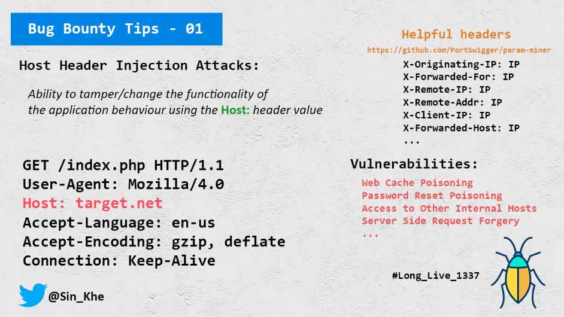

## Host Header Injection
*[tweet](https://twitter.com/Sin_Khe/status/1242428505142562819) by [Sin_Khe](https://twitter.com/Sin_Khe)*



### Useful Headers
These header can be use to bypass and perform host header injection.

You have to use headers according to server and services
- it's context based
- if or if not there is a reverse proxy
- if or if not there is a protection or a cloud

basically we want the ones which "ACCEPT ADDRESS"
``` X-FORWARDED-FOR
X-CLUSTER-CLIENT-IP
X-CLIENT-IP
X-FORWARDED-SERVER
HOST
CLIENT
X-REMOTE-ADDR
X-FORWARDED-BY
X-Originating-IP
X-Remote-IP
X-Host
CLIENT-IP
X-Originating-IP
X-Real-IP
REAL-IP
X-IP
X-Cluster-Client-IP
X-FORWARDED-HOST 
```
*Chk for more Headers here https://github.com/PortSwigger/param-miner/blob/master/resources/headers*

> *All the content on this page is provided by [Sin_Khe](https://twitter.com/Sin_Khe), for any help you can ping him on twitter*
